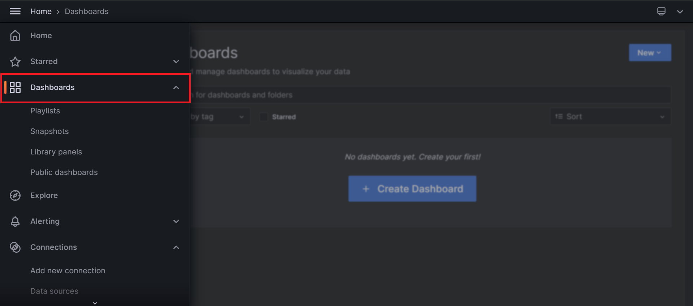
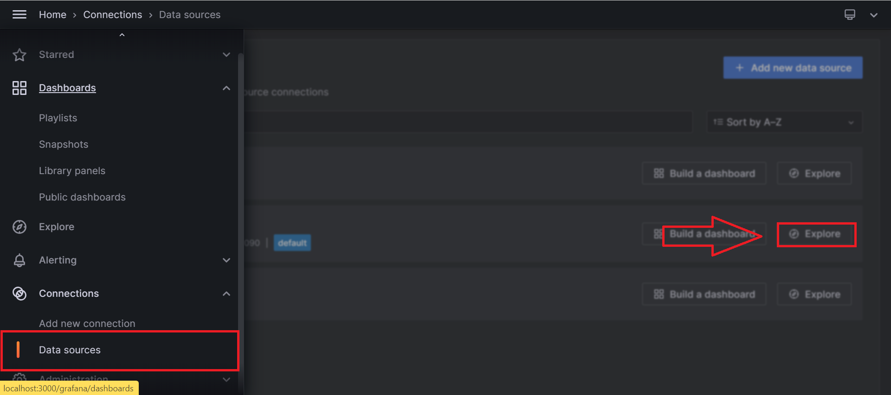
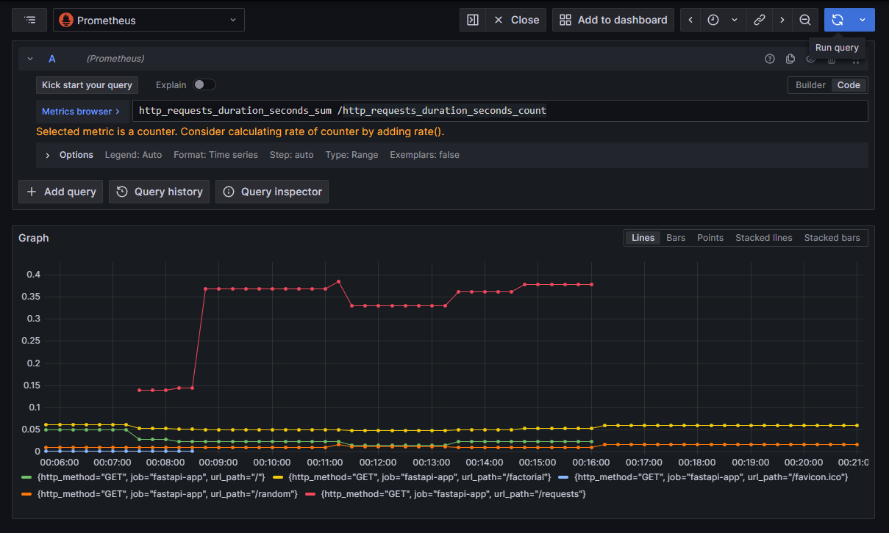
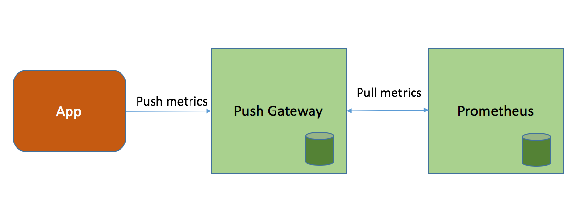
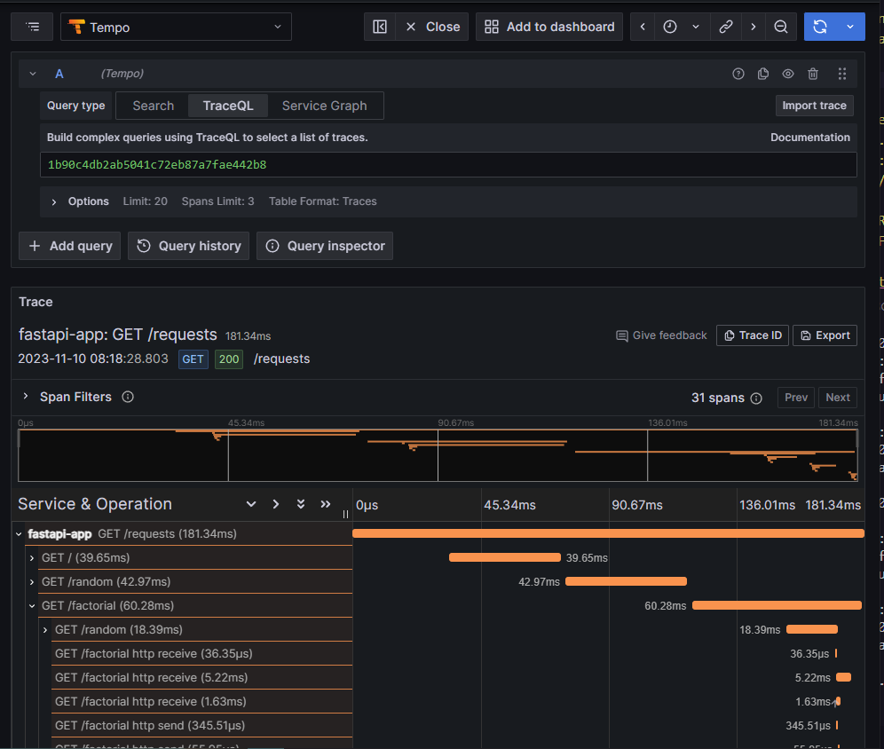
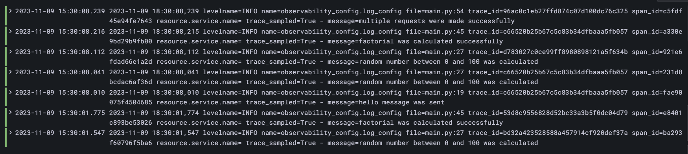
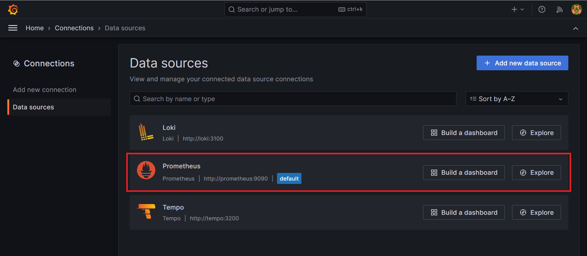
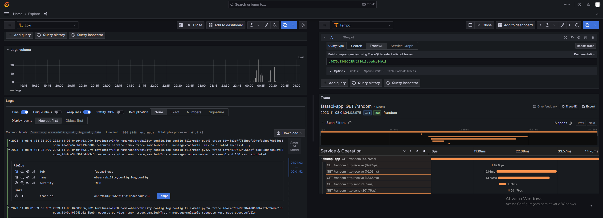

# Pacote de observabilidade

conjunto com as principais ferramentas do mercado para observabilidade, onde qualquer aplicação pode se conectar a ele e enviar seus dados de métrica, logs e traces. Tendo de forma simplificada e pré-configurada acesso a visualizações e alertas. O projeto segue a seguinte arquitetura:


Vale ressaltar que a aplicação feita aqui tem caráter somente de teste do pacote de observabilidade, é possível aplicar os conceitos demonstrados e utilizar o pacote de observabilidade em qualquer outra aplicação, trazendo muito valor ao projeto escolhido.

## Tabela de conteúdos
* [Tecnologias utilizadas](#tecnologias-utilizadas)
* [Requisitos para uso](#requisitos-para-uso)
* [Instalação](#instalação)
* [Como iniciar](#como-iniciar)
    * [Pacote de observabilidade](#pacote-de-observabilidade)
    * [Aplicação FastAPI](#aplicacao-fastapi)
* [Como usar](#como-usar)
    * [Pacote de observabilidade](#pacote-de-observabilidade)
    * [Aplicação FastAPI](#aplicacao-fastapi)
* [Configurações para uso do pacote](#configurações-para-uso-do-grafana)
    * [Métricas](#configurações)
    * [Traces](#configurações)
    * [Logs](#configurações)
* [Configurações Grafana](#configuracoes-grafana)
    * [Datasources](#configurações)
    * [Logs e Traces](#logs-e-traces)

## Tecnologias utilizadas
* Grafana 10.2.0
* Prometheus v2.47.2
* Pushgateway v1.6.2
* Tempo 2.2.0
* Loki 2.9.2
* Nginx 1.25.3-bookworm
* Docker 24.0.5
* Python 3.10

## Requisitos para uso
* IDE - VScode, PyCharm, etc.
* Conta no Docker.hub
* Versão Atualizada do WSL 2 

Caso esteja rodando no sistema operacional windows, é necessário instalar o WSL, seguindo o tutorial do link... [WSL](https://boom-particle-8c8.notion.site/como-instalar-o-wsl2-readme-md-02dcaa42ac7d490bb8f5bb6620669590)

## Instalação
Execute os comandos no terminal da IDE ou no terminal de comando do sistema operacional utilizado:
* 1 - Crie uma pasta:
```
 mkdir observability-package
```
* 2 - Entre na pasta do projeto:
```
 cd observability-package
```
* 3 - Clone o repositório:
```
 git clone https://github.com/Senai-Sorocaba-IC-2023-2/Sergio
```
* 4 - Abra o projeto:
caso esteja usando Visual Studio Code:
```
    code .
```
se não, é possível abrir diretamente pela IDE, buscando a pasta do projeto para abrir nela.

## Como iniciar

### Pacote de observabilidade
* Tendo o seu projeto já aberto, é necessário primeiramente entrar na pasta do pacote de observabilidade, com o comando:
```
    cd observability
```

* Antes de rodar o próximo comando, é necessário garantir que o Docker esteja rodando na máquina, após isso, basta utilizar o seguinte comando:
```
    docker-compose up
```
### Aplicação FastAPI
* Tendo o seu projeto já aberto, é necessário primeiramente entrar na pasta da aplicação fastAPI, com o comando:
```
    cd fastapi-app
```

* Antes de rodar o próximo comando, é necessário garantir que o Docker esteja rodando na máquina, após isso, basta utilizar o seguinte comando:
```
    docker-compose up
```

## Como usar
### Pacote de observabilidade
* 1 - Rodando em ambiente local, basta acessar o navegador

* 1 - No primeiro acesso é necessário realizar o login utilizando para username "admin", e para password "admin", e então redefinir a senha para os próximos acessos.


* É possível acessar os dashboards através da navegação lateral, criar, editar e visualizar os que já foram construídos com as diferentes fontes de dados, como Prometheus, Tempo e Loki.


* É possível também ter acesso aos dados entrando em DataSources, selecionando "explore" em alguma das fontes e utilizando a linguagem de consulta de cada uma delas.


### Aplicação FastAPI
Para gerar as métricas, traces e logs, é possível acessar através de qualquer navegador acessar os endpoints da aplicação, que são:

* Retorna uma mensagem de olá, e desejando boas vindas à aplicação.

    ```http
        http://127.0.0.1:8000/
    ```

* Retorna um numero aleatório de 0 a 100.
    ```http
        http://127.0.0.1:8000/random
    ```

* Faz uma requisição ao endpoint "/random", calcula a fatorial do número e retorna ele.
    ```http
        http://127.0.0.1:8000/factorial
    ```

* Faz requisições aos endpoints "/", "/random" e "/factorial", e retorna uma mensagem.
    ```http
        http://127.0.0.1:8000/requests
    ```

## Configurações para uso do pacote
Para o uso do pacote de observabilidade são necessárias algumas configurações na aplicação, seguindo alguns padrões e formas de envio de métricas, traces e logs. Para esse fim, foi utilizado no projeto a biblioteca [observability-mtl-instrument](https://pypi.org/project/observability-mtl-instrument/), porém, também é possível configurar de forma manual caso seja desejado, das seguintes formas...

### Métricas
Utilizando dados de métricas que são gerados pela aplicação com o uso do [prometheus client](https://prometheus.io/docs/instrumenting/clientlibs), disponíveis em diversas linguagens, e através de requisição http os dados são enviados ao pushgateway, onde o prometheus realiza a busca dos dados.


Em código pode ser implementado da seguinte forma:
```py
    from prometheus_client import Counter, CollectorRegistry, Summary, Gauge, pushadd_to_gateway
    from dotenv import load_dotenv
    import os
    load_dotenv()

    registry = CollectorRegistry()

    status_http_counter = Counter(
        'http_requests_total_by_code',
        'responses total by status code',
        ['http_code'],
        registry=registry
    )

    def send_metrics():
        pushadd_to_gateway(os.environ.get('PROMETHEUS_URL'), job='fastapi-app', registry=registry)
```

* PROMETHEUS_URL: a variável se refere a "<endereço do nginx ou nome do serviço>:<porta>/pushgateway". Passado no .env.
* Envio das métricas: ao chamar a função send_metrics as métricas coletadas que tiveram o registry específico, são enviadas ao pushgateway.



### Traces
Em relação aos traces o envio de dados também pode ser realizado com requisição http, porém utilizando a [sdk do OpenTelemetry para Python](https://github.com/open-telemetry/opentelemetry-python)

```py
    from opentelemetry import trace
    from opentelemetry.sdk.trace import TracerProvider
    from opentelemetry.sdk.trace.export import BatchSpanProcessor
    from opentelemetry.sdk.resources import SERVICE_NAME, Resource
    from opentelemetry.exporter.otlp.proto.http.trace_exporter import OTLPSpanExporter
    from dotenv import load_dotenv
    import os
    from opentelemetry.instrumentation.fastapi import FastAPIInstrumentor

    load_dotenv()

    resource = Resource.create({SERVICE_NAME: "fastapi-app"})
    trace.set_tracer_provider(TracerProvider(resource=resource))

    trace.get_tracer_provider().add_span_processor(
        BatchSpanProcessor(OTLPSpanExporter(endpoint=os.environ.get('TEMPO_URL')))
    )

    tracer = trace.get_tracer(__name__)

    
    FastAPIInstrumentor.instrument_app(app, tracer_provider=trace.get_tracer_provider())
```
* TEMPO_URL: a variável se refere a "http://<endereço do nginx ou nome do serviço>:<porta>/tempo/v1/traces", passado no .env.

* Instrumentação FastApi: No exemplo foi utilizada a instrumentação do FastAPI, que pega os traces id, e o span de forma automática, baseado nas requisições http realizadas dentro do método do endpoint. Nesse caso o span é criado ao usar a seguinte linha de código para fazer uma chamada http:

```py
    from opentelemetry.propagate import inject
    import httpx

    headers = {}
    inject(headers)  # inject trace info to header
    logger.critical(headers)

    async with httpx.AsyncClient() as client:
        await client.get("http://localhost:8000/", headers=headers)
```

obs: Outra forma de criar um trace é de forma manual, com a seguinte linha de código:

```py
    with tracer.start_as_current_span():
        # your code
```

Um exemplo dos traces está na imagem a seguir:



### Logs
A configuração dos logs é parte essencial do projeto, por isso a formatação escolhida para ele é necessária, e deve ser feita incluindo o trace_id e o span_id, afim de que o grafana posso conectar e criar o link para o trace que aquele log referencia, sendo feito da seguinte forma:

```
    log_format = '%(asctime)s levelname=%(levelname)s name=%(name)s file=%(filename)s:%(lineno)d trace_id=%(otelTraceID)s span_id=%(otelSpanID)s resource.service.name=%(otelServiceName)s trace_sampled=%(otelTraceSampled)s - message="%(message)s"'
```



Já em relação ao envio dos logs ao Grafana Loki, é necessário somente uma requisição HTTP, seguindo o padrão definido pela documentação do [Loki](https://grafana.com/docs/loki/latest/reference/api/), da seguinte forma:

```
{
    "streams": [
        {
        "stream": {
            "label": "value"
        },
        "values": [
            [ "<unix epoch in nanoseconds>", "<log line>" ],
            [ "<unix epoch in nanoseconds>", "<log line>" ]
        ]
        }
    ]
}
```

No código exemplo em Python a adição da requisição HTTP no handler do log foi feita da seguinte forma:

```py
    class URLLogHandler(logging.Handler):
        def __init__(self, formatter):
            super(URLLogHandler, self).__init__()
            self.formatter = logging.Formatter(formatter)

        def emit(self, record):
            log_entry = self.format(record)
            response = send_logs(record, log_entry, 'fastapi-app',  
    os.environ.get('LOKI_URL'))
            return response
```

* LOKI_URL: a variável se refere a "http://<enredeço do nginx ou nome do serviço>:< porta>/loki/api/v1/push"

* Inserção de trace_id: No projeto foi utilizada uma instrumentação que adiciona no log automaticamente o trace id, porém é possível também pegar manualmente.

## Configurações Grafana
O grafana possui muitos arquivos que possibilitam sua customização, e algumas dessas configurações foram essenciais para o desenvolvimento do pacote, o conhecimento delas é importante para possíveis manutenções, resoluções de erro e adição de recursos personalizados. Essas configurações são passadas como volumes para o Grafana, da seguinte forma:

```
    grafana:
        image: grafana/grafana:10.2.0
        restart: always
        container_name: grafana
        ports:
            - 3000:3000
        volumes:
    -->     - ./etc/grafana/:/etc/grafana/provisioning/datasources
```

Nesse exemplo os arquivos no meu diretório dentro da pasta grafana, que está na pasta etc, é passada como configuração, redefinindo os conteúdos da pasta provisioning. 

### DataSources
Os DataSources são as fontes de dados que o Grafana acessa para gereção de dashboards e alertas. Assim como os demais recursos do Grafana, é possível adicionar através da interface gráfica, porém, para que isso não seja necessário caso ocorra a criação de novos containers dele, é possível configurar através de um arquivo ".yaml", da seguinte forma:

```
    apiVersion: 1

    datasources:
    - name: Prometheus
    type: prometheus
    access: proxy
    orgId: 1
    url: http://prometheus:9090
    basicAuth: false
    isDefault: true
    version: 1
    editable: true
```

Aqui um datasource do Prometheus está sendo configurado para que haja acesso a esses dados nativamente.



## Logs e Traces
Para que os traces e logs estejam relacionados, é necessário que a mensagem do log contenha o trace id, e essa relação é realizada no Grafana através do datasources.yaml, onde uma expressão regular retira da mensagem de log a informação do trace e cria o link no dashboard, da seguinte forma:

```
- name: Loki
  type: loki
  access: proxy
  orgId: 1
  url: http://loki:3100
  basicAuth: false
  isDefault: false
  version: 1
  editable: true
  apiVersion: 1
  jsonData:
    derivedFields:
--->    - datasourceUid: tempo
--->    matcherRegex: "trace_id=(\\w+)"
--->    name: trace_id
--->    url: $${__value.raw}
```

