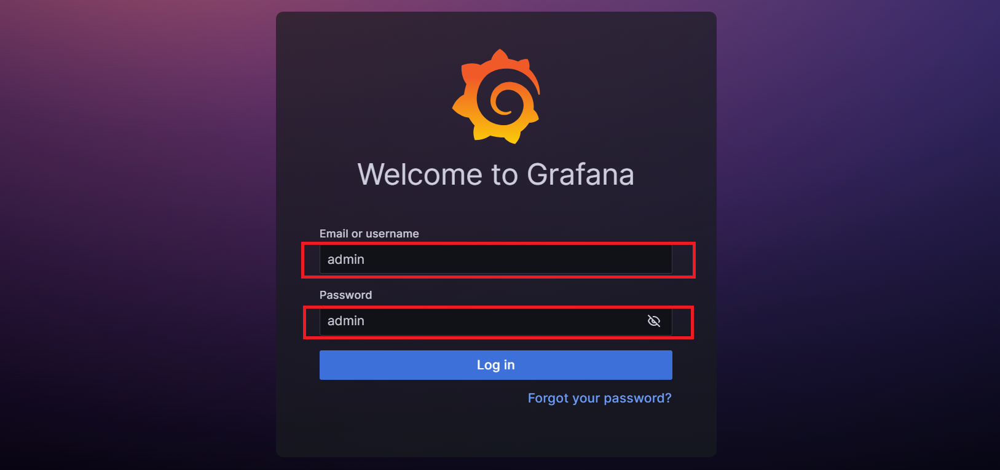

# Pacote de observabilidade

conjunto com as principais ferramentas do mercado para observabilidade, tratado de forma agnóstica, onde qualquer aplicação pode se conectar a ele e enviar seus dados de métrica, logs e traces. Tendo de forma simplificada e pré-configurada acesso a visualizações e alertas. O projeto segue a seguinte arquitetura:


Vale ressaltar que a aplicação feita aqui tem caráter somente de teste do pacote de observabilidade, é possível aplicar os conceitos demonstrados e utilizar o pacote de observabilidade em qualquer outra aplicação, trazendo muito valor ao projeto escolhido.

## Tabela de conteúdos
* [Tecnologias utilizadas](#tecnologias-utilizadas)
* [Requisitos para uso](#requisitos-para-uso)
* [Instalação](#instalação)
* [Como iniciar](#como-iniciar)
    * [Pacote de observabilidade](#pacote-de-observabilidade)
    * [Aplicação FastAPI](#aplicacao-fastapi)
* [Como usar](#como-usar)
    * [Pacote de observabilidade](#pacote-de-observabilidade)
    * [Aplicação FastAPI](#aplicacao-fastapi)
* [Configurações para uso do pacote](#configurações-para-uso-do-grafana)
    * [Métricas](#configurações)
    * [Traces](#configurações)
    * [Logs](#configurações)
* [Configurações Grafana](#configuracoes-grafana)
    * [Datasources](#configurações)

## Tecnologias utilizadas
* Grafana 10.2.0
* Prometheus v2.47.2
* Pushgateway v1.6.2
* Tempo 2.2.0
* Loki 2.9.2
* Nginx 1.25.3-bookworm
* Docker 24.0.5
* Python 3.10

## Requisitos para uso
* IDE - VScode, PyCharm, etc.
* Conta no Docker.hub
* Versão Atualizada do WSL 2 

Caso esteja rodando no sistema operacional windows, é necessário instalar o WSL, seguindo o tutorial do link... [WSL](https://boom-particle-8c8.notion.site/como-instalar-o-wsl2-readme-md-02dcaa42ac7d490bb8f5bb6620669590)

## Instalação
Execute os comandos no terminal da IDE ou no terminal de comando do sistema operacional utilizado:
* 1 - Crie uma pasta:
```
 mkdir observability-package
```
* 2 - Entre na pasta do projeto:
```
 cd observability-package
```
* 3 - Clone o repositório:
```
 git clone https://github.com/Senai-Sorocaba-IC-2023-2/Sergio
```
* 4 - Abra o projeto:
caso esteja usando Visual Studio Code:
```
    code .
```
se não, é possível abrir diretamente pela IDE, buscando a pasta do projeto para abrir nela.

## Como iniciar

### Pacote de observabilidade
* Tendo o seu projeto já aberto, é necessário primeiramente entrar na pasta do pacote de observabilidade, com o comando:
```
    cd observability
```

* Antes de rodar o próximo comando, é necessário garantir que o Docker esteja rodando na máquina, após isso, basta utilizar o seguinte comando:
```
    docker-compose up
```
### Aplicação FastAPI
* Tendo o seu projeto já aberto, é necessário primeiramente entrar na pasta da aplicação fastAPI, com o comando:
```
    cd fastapi-app
```

* Antes de rodar o próximo comando, é necessário garantir que o Docker esteja rodando na máquina, após isso, basta utilizar o seguinte comando:
```
    docker-compose up
```

## Como usar
### Pacote de observabilidade
* 1 - Rodando em ambiente local, basta acessar o navegador

* 1 - No primeiro acesso é necessário realizar o login utilizando para username "admin", e para password "admin", e então redefinir a senha para os próximos acessos.


* É possível acessar os dashboards através da navegação lateral, criar, editar e visualizar os que já foram construídos com as diferentes fontes de dados, como Prometheus, Tempo e Loki.


* É possível também ter acesso aos dados entrando em DataSources, selecionando "explore" em alguma das fontes e utilizando a linguagem de consulta de cada uma delas.


### Aplicação FastAPI
Para gerar as métricas, traces e logs, é possível acessar através de qualquer navegador acessar os endpoints da aplicação, que são:

* Retorna uma mensagem de olá, e desejando boas vindas à aplicação.

    ```http
        http://127.0.0.1:8000/
    ```

* Retorna um numero aleatório de 0 a 100.
    ```http
        http://127.0.0.1:8000/random
    ```

* Faz uma requisição ao endpoint "/random", calcula a fatorial do número e retorna ele.
    ```http
        http://127.0.0.1:8000/factorial
    ```

* Faz requisições aos endpoints "/", "/random" e "/factorial", e retorna uma mensagem.
    ```http
        http://127.0.0.1:8000/requests
    ```

## Configurações para uso do pacote
Para o uso do pacote de observabilidade são necessárias algumas configurações na aplicação, seguindo alguns padrões e formas de envio de métricas, traces e logs.

### Métricas
Na abordagem utilizada os dados de métricas são gerados pela aplicação com o uso do [prometheus client](https://prometheus.io/docs/instrumenting/clientlibs), disponíveis em diversas linguagens, e através de requisição http os dados são enviados ao pushgateway, onde o prometheus realiza a busca dos dados.


Em código foi realizado da seguinte forma:
```py
    from prometheus_client import Counter, CollectorRegistry, Summary, Gauge, pushadd_to_gateway
    from dotenv import load_dotenv
    import os
    load_dotenv()

    registry = CollectorRegistry()

    status_http_counter = Counter(
        'http_requests_total_by_code',
        'responses total by status code',
        ['http_code'],
        registry=registry
    )

    def send_metrics():
        pushadd_to_gateway(os.environ.get('PROMETHEUS_URL'), job='fastapi-app', registry=registry)
```

* PROMETHEUS_URL: a variável se refere a "<endereço do nginx ou nome do serviço>:<porta>/pushgateway". Passado no .env.
* Envio das métricas: ao chamar a função send_metrics as métricas coletadas que tiveram o registry específico, são enviadas ao pushgateway.

### Traces
Em relação aos traces o envio de dados também foi realizado com requisição http, porém utilizando a [sdk do OpenTelemetry para Python](https://github.com/open-telemetry/opentelemetry-python)

```py
    from opentelemetry import trace
    from opentelemetry.sdk.trace import TracerProvider
    from opentelemetry.sdk.trace.export import BatchSpanProcessor
    from opentelemetry.sdk.resources import SERVICE_NAME, Resource
    from opentelemetry.exporter.otlp.proto.http.trace_exporter import OTLPSpanExporter
    from dotenv import load_dotenv
    import os
    from opentelemetry.instrumentation.fastapi import FastAPIInstrumentor

    load_dotenv()

    resource = Resource.create({SERVICE_NAME: "fastapi-app"})
    trace.set_tracer_provider(TracerProvider(resource=resource))

    trace.get_tracer_provider().add_span_processor(
        BatchSpanProcessor(OTLPSpanExporter(endpoint=os.environ.get('TEMPO_URL')))
    )

    tracer = trace.get_tracer(__name__)

    
    FastAPIInstrumentor.instrument_app(app, tracer_provider=trace.get_tracer_provider())
```
* TEMPO_URL: a variável se refere a "http://<endereço do nginx ou nome do serviço>:<porta>/tempo/v1/traces", passado no .env.

* Instrumentação FastApi: No exemplo foi utilizada a instrumentação do FastAPI, que pega os traces id, e o span de forma automática, baseado nas requisições http realizadas dentro do método do endpoint .

obs: Outra forma de criar um trace é de forma manual, com a seguinte linha de código:

```py
    with tracer.start_as_current_span():
        # your code
```

### Logs